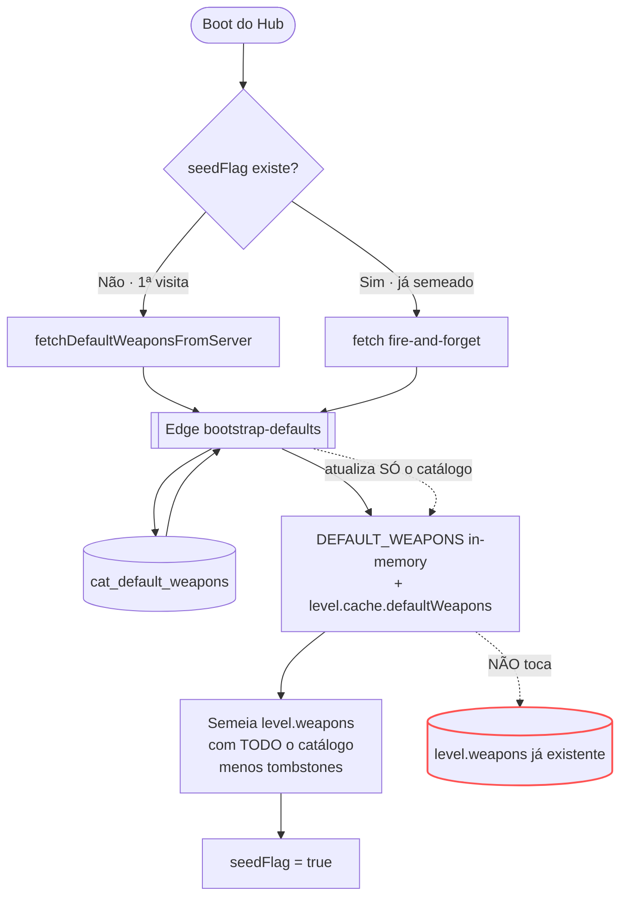
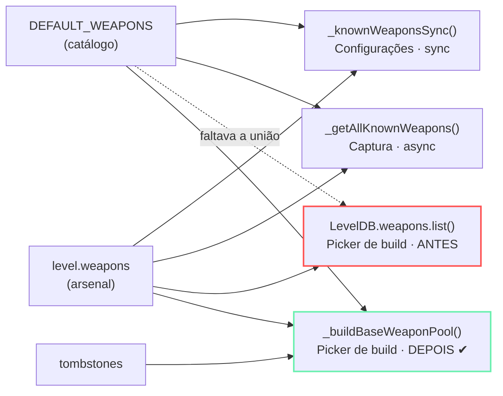
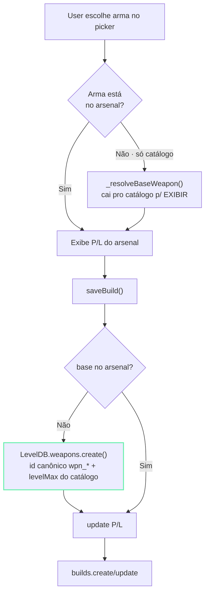

# LEVEL — Subsistema de Armas (deep-dive)

> Companion de `ARCHITECTURE.md`. Foca **um** domínio: **Armas** — catálogo, arsenal,
> fotos, acessórios e as (muitas) formas de "ler uma arma". Escrito depois do bug da
> **CBRS-3** (Jul/2026), que expôs a fragmentação descrita aqui.
>
> **Status:** mapeia o **estado atual** (fonte de verdade espalhada) e propõe o **alvo**
> (`WeaponRepo` unificado). Migração **incremental, por gatilho** — §7, alinhado à §9 do
> `ARCHITECTURE.md` e ao `BACKLOG.md`.

---

## 0. TL;DR (o problema em 4 linhas)

Uma "arma" vive hoje em **11 lugares** e existem **3 funções diferentes** que fazem quase
a mesma coisa ("todas as armas que o user conhece"), divergindo em *sync/async* e em
*respeitar-ou-não tombstones*. A separação **catálogo global (DB) × arsenal pessoal
(localStorage)** é sã e fica. O que dói é a **leitura fragmentada** — foi por aí que a
CBRS-3 sumiu do "+ Adicionar Arma". O alvo é **uma** camada de leitura: `WeaponRepo`.

---

## 1. Inventário — onde vive uma arma

| # | Fonte | Tipo | Papel | Chave/id |
|---|---|---|---|---|
| 1 | `cat_default_weapons` | Postgres | **catálogo canônico** (classe, P/L default, `is_active`, `sort_order`, `master`, `maxed`, `is_new`, `meta`) | `id` = `wpn_*` |
| 2 | `cat_default_images` | Postgres | **foto** da arma | `item_id` = `wpn_*` |
| 3 | Edge `bootstrap-defaults` | Deno/TS | serve o catálogo (snake→camel: `level_max`→`levelMax`, `is_active`→`isActive`) | — |
| 4 | `DEFAULT_WEAPONS_FALLBACK` | JS literal | **fallback offline** (2 armas: Sturmwolf + Peacekeeper) | `index.html` |
| 5 | `DEFAULT_WEAPONS` / `window.DEFAULT_WEAPONS` | JS in-memory | **espelho vivo** do catálogo servido | atualizado in-place |
| 6 | `level.cache.defaultWeapons` | localStorage | **cache** do último fetch (offline-first) | — |
| 7 | `level.weapons` (`LevelDB.weapons`) | localStorage | **arsenal pessoal** (progresso real: P/L/master do user) | `id` = `wpn_*` |
| 8 | `level.weapons.tombstones` | localStorage | **armas apagadas** de propósito (anti-reseed) | `[wpn_*]` |
| 9 | `WEAPON_UNLOCKS` | JS | **catálogo de acessórios** por arma | keyed por `wpn_*` |
| 10 | `LevelWeaponBg` | localStorage | **fundo** da foto por classe | por `w.class` |
| 11 | `is_active` (coluna) | Postgres | flag de "arma ativa" — **semântica frágil** (ver §4) | — |

**Legítimo (não mexer):** #1 (catálogo global) × #7 (arsenal pessoal) são coisas
diferentes. #4/#5/#6 são resiliência offline-first. **Acidental (a dor):** #5 ser lido por
3 uniões divergentes, #11 ambíguo, e a ausência de um caminho canônico de **materialização**
(catálogo → arsenal).

---

## 2. Fluxo — boot, seed e refresh

O ponto crítico está no ramo **"já semeado"**: o refresh atualiza o catálogo em memória
mas **nunca toca no arsenal**. Foi exatamente isto que criou o bug da CBRS-3.



**Consequência:** quem semeou o arsenal **antes** de uma arma existir no catálogo nunca a
recebe no arsenal. Users novos (seed depois) a têm; users antigos, não.

---

## 3. Fluxo — leitura (as uniões) e o fix

Três telas, três implementações da mesma ideia. A do picker de build lia **só o arsenal**.



Note que nem `_knownWeaponsSync` nem `_getAllKnownWeapons` filtram tombstones — o novo
`_buildBaseWeaponPool` filtra (um picker de "adicionar" não deve ressuscitar o que o user
apagou). É a versão mais correta das três; as outras devem convergir pra ela (§7).

---

## 4. Semântica dos campos (o que confunde)

- **`is_active`** — hoje **1 única** arma no catálogo inteiro é `true` (a Sturmwolf 45). Não
  é filtro de catálogo (senão só 1 arma apareceria em todo lado). É mais um resquício de
  "arma em destaque". **A edge serve como `isActive || undefined`** — ou seja, quase todas
  chegam sem o campo. **Decisão pendente:** documentar como "destaque" e renomear, ou
  remover. Enquanto isso: **não** usar `is_active` como filtro em lugar nenhum.
- **`id` canônico (`wpn_*`)** — é a cola. Foto (#2), acessórios (#9) e arsenal (#7) são todos
  keyed por ele. **Materializar preservando o `id`** é o que mantém foto+acessórios ligados.
- **tombstones** — o user apagou de propósito; `seedIfNeeded` respeita, o picker novo também.
- **`levelMax`** — vem do catálogo (`level_max`). A materialização copia o do catálogo (ex.:
  CBRS-3 = 42), **não** o default 38.

---

## 5. Post-mortem — CBRS-3 & o fix aplicado

**Sintoma:** "coloquei a foto da CBRS-3 nas Configurações, mas ela não aparece no
'+ Adicionar Arma'."

**Causa raiz:** as Configurações usam a **união** (`_knownWeaponsSync`) → a foto pôde ser
posta. O picker de "+ Adicionar Arma" (`populateBaseDropdown`/`renderBasePicker`) lia
**só o arsenal** (`LevelDB.weapons.list()`). A CBRS-3 entrou no catálogo **depois** do seed
do user → nunca esteve no arsenal dele → invisível no picker. O refresh "arma nova" (v3.10.1)
só cobriu as Configurações; o dropdown de arma base ficou de fora.

**Fix (materialização + união), `index.html`:**



Funções tocadas: `_buildBaseWeaponPool` e `_resolveBaseWeapon` (novas) · `populateBaseDropdown`
· `renderModalDynamicParts` · `openAttChooser` · handler do combobox de prestige ·
`suggestBuildName` · `saveBuild` (materializa). **Verificado** end-to-end simulando um arsenal
sem a CBRS-3: aparece no picker (50 vs 49), materializa com `id` canônico, cria a build.

---

## 6. Modelo-alvo — `WeaponRepo` (uma camada de leitura)

Uma fonte única de "armas conhecidas", com materialização explícita. Todas as telas passam a
consumir daqui — acabam as 3 uniões divergentes.

```js
// services/weapon-repo.js (alvo)
export const WeaponRepo = {
  catalog(),                 // DEFAULT_WEAPONS (espelho do DB, com fallback/cache)
  arsenal(),                 // level.weapons (progresso do user)
  tombstones(),              // Set de ids apagados
  known({ withTombstoned }), // UNIÃO canônica: arsenal vence catálogo; filtra tombstones
  resolve(id),               // arsenal → senão catálogo (p/ exibir sem materializar)
  materialize(id),           // catálogo → arsenal com id canônico (idempotente)
  photo(id), unlocks(id), bg(weapon), // assets keyed por id/classe
};
```

Invariantes: **(a)** `arsenal` sempre vence `catalog` no merge (progresso real);
**(b)** `materialize` é idempotente e **preserva o `id`**; **(c)** tombstones respeitados por
padrão. `_buildBaseWeaponPool`/`_resolveBaseWeapon` de hoje são o **protótipo** disto.

---

## 7. Migração incremental (por gatilho, sem big-bang)

Alinhado à §9 do `ARCHITECTURE.md`. Cada passo = 1 versão no changelog, verificável antes do
próximo.

1. **Doc + fluxogramas** (este ficheiro). ✅
2. **Fix CBRS-3** — picker via união + materialização. ✅ *(protótipo do `WeaponRepo`)*
3. **Convergir as uniões** — `_knownWeaponsSync` (Configurações) e `_getAllKnownWeapons`
   (Captura) passam a chamar o mesmo core de `_buildBaseWeaponPool`. Some a divergência
   sync/async e o tratamento de tombstones fica consistente.
4. **Extrair `WeaponRepo`** — quando o arsenal virar módulo (feature `arsenal/`), mover a
   união/resolve/materialize pra `services/weapon-repo.js`. Telas passam a importar.
5. **Resolver `is_active`** — decidir destaque×remoção, documentar, migrar dados.
6. **Assets sob o repo** — `photo/unlocks/bg` como métodos, não globais soltos.

---

## 8. Roadmap dos outros subsistemas (esboço em fases)

Mesma receita ("mapa → fix de dor → repo unificado → extração"), por ordem de dor. Detalhar
um de cada vez, quando cada um for mexido a fundo (gatilho).

| Subsistema | Fontes de verdade (hoje) | Dor provável | Fase-alvo |
|---|---|---|---|
| **Builds** | `cat_default_builds`, `hub_builds`, `level.builds`, `WEAPON_UNLOCKS` (attach), `modalState` | vínculo build↔arma base (materialização), slots fixos=9 | `BuildRepo` sobre o `WeaponRepo` |
| **Mapas** | `cat_maps`, `MAPS_CATALOG`, `level.cache.maps`, ilha `/maps-interactive/` | id raw×prefixo (já mordeu, v5), detalhe portado×ilha | `MapRepo` + doc da ilha |
| **Loadouts** | `hub_loadouts`, `level.loadouts`, legado `bo7hub_loadouts_v1` | migração legada, ref a `weaponId` | consolidar sob repos |
| **Perfil/Progressão** | `hub_users`, `level.player`, `player_history`, snapshots | push imediato×auto-pull (já mordeu: nível revertia) | `actions.saveProfile` único |
| **Moderação** | `moderation_queue`, `user_red_flags`, `sync_state`, `CBI18N` | i18n em 2 dicionários, papéis/red flags | doc do fluxo fila→painel |
| **Sync/Realtime** | `sync-push/pull`, `sync_state`, LWW, tombstones | LWW por entidade, `force` só perfil/settings | doc de invariantes LWW |
| **Avatares** | `user-asset` (slots), `generate-avatar`, dataURL | signed URL expira → dataURL, presets na edge | `AssetRepo` |
| **Captura** | `share-ingest`, `analyze-capture`, `_getAllKnownWeapons`, `matchWeapon` | matching vision→catálogo, materialização | reusa `WeaponRepo` |

---

*Deep-dive de Armas por Cráudio · Jul 2026. Acompanha `ARCHITECTURE.md` (§9 migração),
`BACKLOG.md` (timing) e `LEVEL_ESTADO.md` (marcos).*
